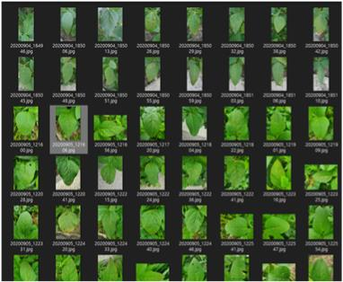
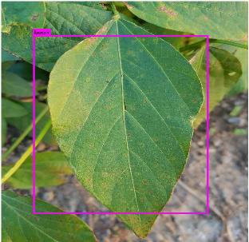
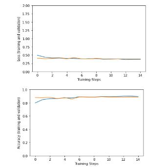
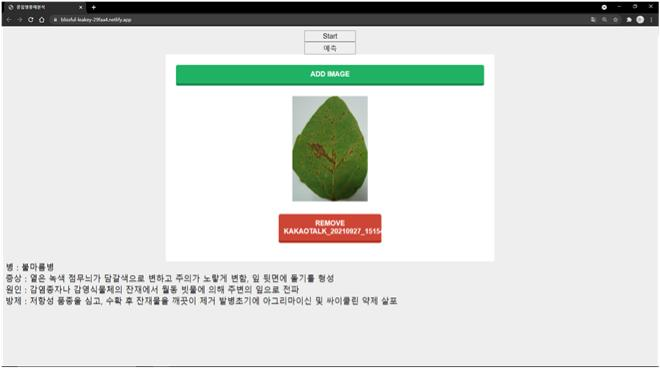

# 2021학년도 순천대학교 ICT융합공학부 정보통신공학전공 구본근 졸업작품
 
## MobileNET 기반 콩잎 병해충 이미지 분석
분류 모델인 MobileNET을 활용하여 콩잎 불마름병, 점무늬병을 탐지하고 분류하여 조기 예방에 도움준다.
 
 

### 데이터 수집
콩잎 불마름병, 점무늬병 약 3000장의 데이터 셋을 담당 교수님께서 제공해주셨다.

 

### 데이터 전처리

- 3000장의 데이터를 노이즈, 회전 등의 데이터 부풀리기를 진행예정

- YOLO v3 기반 객체 탐지를 적용하여 객체의 좌표 추출 후 resize된 이미지를 전이 학습된 분류 모델에 적용

  

   

### 데이터 분석

- 파라미터가 적어 학습 속도가 빠르고 정확도 높은  mobilenet 모델을 사용한다.
- 훈련과 검증 이미지를 8대2로 나눠 학습 시킨다.

 

### 데이터 해석/시각화

- 웹 프로토타입 제작
- 설정한 수치값 이상으로 나온다면 병, 원인, 방제 등을 출력

